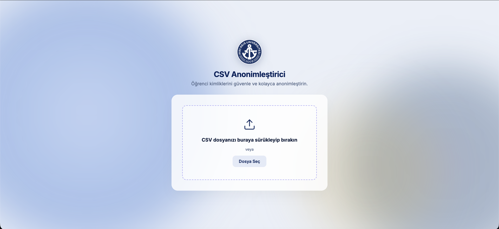
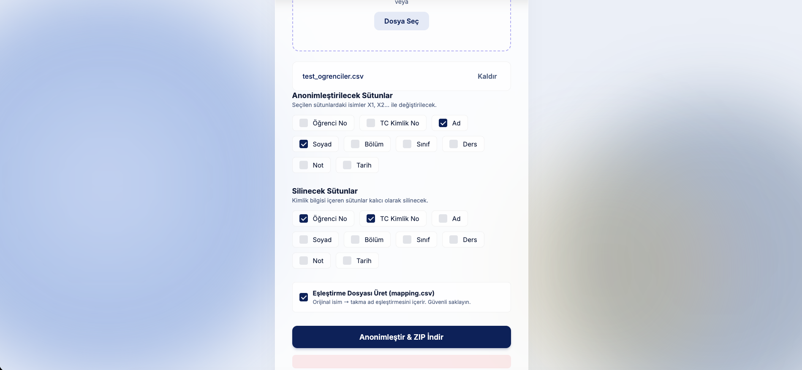

# CSV Anonimleştirici

Bu araç, öğrenci verilerini içeren CSV dosyalarındaki kimlik bilgilerini anonimleştirmek amacıyla geliştirilmiştir. Python tabanlı bir arka uç ve web tarayıcısı üzerinden erişilebilen bir ön yüz arayüzünden oluşmaktadır.

## Özellikler

- Otomatik kodlama algılama: UTF-8, UTF-8-SIG, CP1254, Latin-1
- Otomatik sütun ayracı tespiti (virgül ve noktalı virgül)
- Ad/soyad sütunlarını otomatik tanıma ve anonimleştirme (X1, X2, ...)
- TC Kimlik No ve Öğrenci No gibi kimlik sütunlarını otomatik silme
- İsteğe bağlı eşleştirme dosyası (mapping.csv) üretimi
- İşlem özeti (summary.json) çıktısı
- 100.000 satırlık bloklar hâlinde işleme — büyük dosyalarda sabit bellek kullanımı




## Proje Yapısı

```
csv_anonymizer/
├── main.py              # FastAPI uygulama katmanı ve API uç noktaları
├── anonymizer.py        # CSV ayrıştırma ve anonimleştirme mantığı
├── requirements.txt     # Python bağımlılıkları
├── README.md
└── static/
    ├── index.html
    ├── style.css
    └── script.js
```

## Kurulum

Python 3.8 veya üzeri gereklidir.

```bash
pip install -r requirements.txt
```

## Çalıştırma

```bash
uvicorn main:app --reload
```

Uygulama başlatıldıktan sonra tarayıcıdan şu adrese erişin:

```
http://localhost:8000
```

## Kullanım

1. CSV dosyasını arayüze sürükleyip bırakın veya "Dosya Seç" düğmesini kullanın.
2. Sistem, anonimleştirilecek ve silinecek sütunları otomatik olarak önerir.
3. Gerekirse sütun seçimlerini manuel olarak düzenleyin.
4. "Eşleştirme Dosyası Üret" seçeneğini işaretli bırakırsanız orijinal isim — takma ad tablosu da çıktıya eklenir.
5. "Anonimleştir & ZIP İndir" düğmesine tıklayın.
6. İndirilen ZIP dosyası şunları içerir:
   - `anonymized.csv` — anonimleştirilmiş veri
   - `mapping.csv` — eşleştirme tablosu (seçili ise)
   - `summary.json` — işlem özeti

## Güvenlik ve Açık Kaynak Kullanımı

Bu proje GitHub üzerinde açık kaynak olarak paylaşılmaya tamamen uygundur. Kod içerisinde okula veya kuruma ait **hiçbir gizli veri, şifre veya hassas bilgi bulunmamaktadır**.

Açık ağlarda (internet) sunucuya kurulacağı zaman aşağıdaki güvenlik önlemleri aktif olarak çalışır:

1. **Dosya Boyutu Sınırı:** Sunucunun çökmesini engellemek için maksimum **2 GB** dosya yükleme sınırı vardır.
2. **Rate Limiting (Hız Sınırı):** DDos ve spam saldırılarını önlemek için IP başına dakikada maksimum 5 anonimleştirme isteği yapılabilir. (Bunun için `slowapi` kullanılmıştır).
3. **API Anahtarı (Authentication):** Dışarıdan izinsiz erişimleri engellemek için API bir anahtar ile korunur.
   - Varsayılan anahtar: `change_this_secret_key_in_production`
   - Kendi sunucunuza kurarken `.env` dosyası veya ortam değişkenleri (Environment Variables) üzerinden `ANONYMIZER_API_KEY` değerini mutlaka değiştirin. Frontend kodundaki (`script.js`) anahtarı da aynı şekilde güncellemelisiniz.
4. **HTTPS Zorunluluğu:** Verilerin ağ üzerinde şifrelenerek taşınması için uygulamayı canlıya alırken mutlaka bir **SSL Sertifikası** (örn. Cloudflare veya Let's Encrypt Nginx) arkasında çalıştırın.

## Çıktı Formatları

| Dosya | İçerik |
|---|---|
| `anonymized.csv` | Kişisel bilgilerden arındırılmış veri seti |
| `mapping.csv` | Orijinal değer, takma ad ve tekrar sayısı |
| `summary.json` | Satır sayısı, benzersiz öğrenci sayısı, silinen sütunlar |
